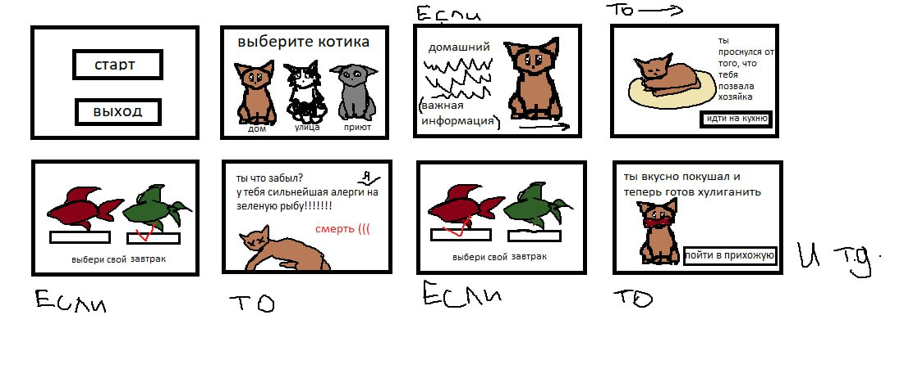

# project

1.
На главной странице между вами предстоит выбор начать игру или покинуть этот прекрасный и чудесный мир игры про котиков. Чтобы сделать этот наитруднейший выбор на экране появятся 2 чудесненьких кнопочки:
Кнопка «старт» начинает игру
Кнопка «выход» выходит из игры 
2.
На последующей странице вам так же предстоит сделать главнейший выбор. Выбор кота. Вы определите судьбу какого котика вам придется прожить вместе с ним!!!
Кнопка «домашний» с фотокарточкой прекрасного рыжего котика над ней. Она приглашает вас прожить частичку жизни обыкновенного домашнего кота, управляя его действиями.
Кнопка «уличный» с фотокарточкой бедного черно-белого котика над ней. Она приглашает вас прожить частичку тяжелой жизни кота на улице, управляя его действиями.
Кнопка «кот с приюта» с фотокарточкой грустного серого котика над ней. Она приглашает вас прожить частичку нудной жизни кота в приюте, управляя его действиями.
3.
Например, ваш выбор остановился на кнопке «домашний».  В этом случае на экране появиться подробное описание выбранного вами котика. На данном слайде написана важная информация, которая может повлиять на исход событий в игре.
Внизу экрана присутствует кнопка «». Она переносит вас в начало вашей истории.
4. 
На этой странице начнется ваша история. К примеру, в истории рыжего кота на этой странице он просыпается и слышит голос хозяйки.
Внизу с помощью кнопки (например, «идти на кухню») вы перемещаетесь на следующую страницу. 
5/7.
На этой странице перед вами появляется первый выбор при помощи кнопок «выбрать»:
При нажатии на правую кнопку, вы выбираете на завтрак коту зеленую рыбу.
При нажатии на левую кнопку, вы выбираете на завтрак коту красную рыбу.
6/8.
При выборе зеленой рыбы вы меняете ход игры в отрицательную сторону и ваш котик, при определенной вероятности либо сильно отравляется, либо умирает.
Если вам выпало отравление, внизу экрана появляется кнопка «», которая перемещает вас на страницу с продолжением истории.
Если вам выпала смерть, внизу экрана появляется кнопка «завершить игру и вернуться на главный экран», которая перемещает вас на главную страницу.
При выборе красной рыбы котик получает удовольствие от сделанного вами выбора в пользу его любимого лакомства. 
Внизу кнопка «пойти в прихожую» позволяет переместиться на следующую страницу и продолжить игру. 

и т.д.

